###  Docker 

### Overview

Docker is an open platform for developing, shipping, and running applications. Docker enables you to separate your applications from your infrastructure so you can deliver software quickly. With Docker, you can manage your infrastructure in the same ways you manage your applications. By taking advantage of Docker’s methodologies for shipping, testing, and deploying code quickly, you can significantly reduce the delay between writing code and running it in production.

Docker provides the ability to package and run an application in a loosely isolated environment called a container. The isolation and security allow you to run many containers simultaneously on a given host. Containers are lightweight and contain everything needed to run the application, so you do not need to rely on what is currently installed on the host. You can easily share containers while you work, and be sure that everyone you share with gets the same container that works in the same way.

Docker streamlines the development lifecycle by allowing developers to work in standardized environments using local containers which provide your applications and services. Containers are great for continuous integration and continuous delivery (CI/CD) workflows.

### Instructions

### Exercise 1: Getting started with Docker

1. On the LabVM provided to you, from the left click on **Visual Studio code**  and open it.

   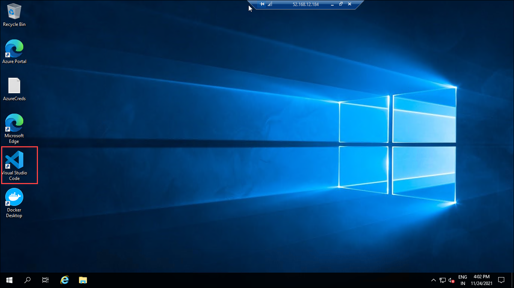


2. In the **Visual Studio code** notice docker has been already installed.

   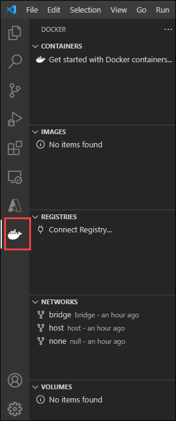

3. Now to run docker commands open Terminal by clicking on **Terminal (1)** and **New Terminal (2)**.

   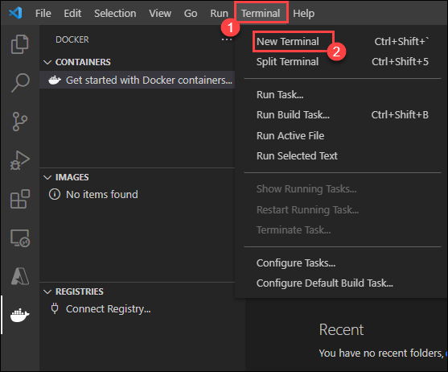

4. In the terminal type  ```docker``` and hit enter. This will list the available commands.

   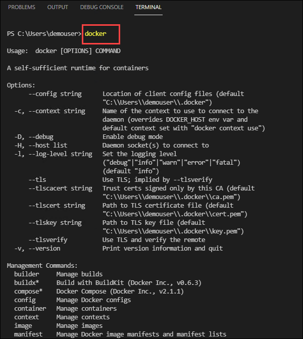

5. Now run the below command to get the docker version information.  This command will render all the version information of the docker installed in an easy to read layout.

   ```
     docker version
   ```
   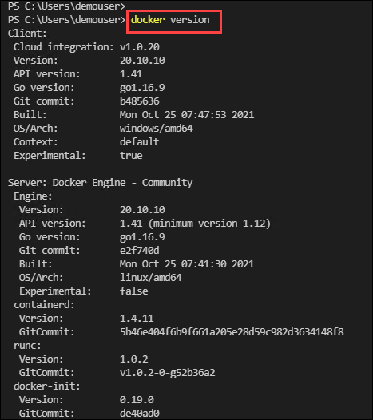

6. Type the following command to get system-wide information regarding the Docker installation.  The information displayed includes the kernel version, number of containers, and images. As we have not yet created any containers or images you will receive the container and images count as zero.

   ```
     docker info
   ```
   
   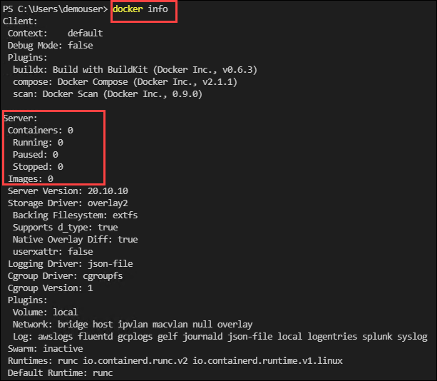


### Exercise 2:  Working with Docker Containers

A Docker container image is a lightweight, standalone, executable package of software that includes everything needed to run an application: code, runtime, system tools, system libraries and settings.


1. In the terminal run the below command to list all of the containers. This command will list all the containers that are present in your docker.

   ```
   docker ps -a
   ```
   
   > **Note**: 
     - As we have not created any docker containers the command will return an empty list. 
     - ```docker ps``` command will list only running containers
   
2. Now to create a docker container run the below command. This command runs a container named test using the ubuntu:18.04 image. The -it instructs Docker to allocate a pseudo-TTY connected to the container’s stdin; creating an interactive bash shell in the container. 

   ```
   docker container run --name test -it ubuntu:18.04 /bin/bash
   ```
   
   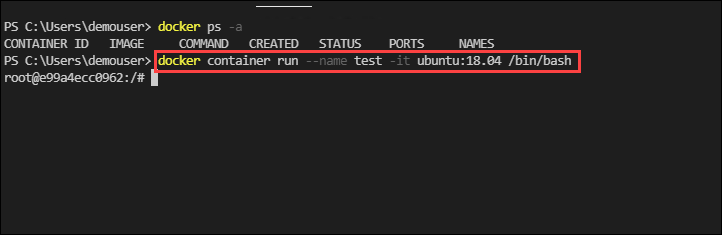
  
3. Notice that you are logged in to the container. 

   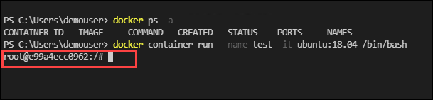


4. Now, inside the container run the following command to verify the operating system you are working on.

   ```
   cat /etc/*release*
   ```
   
   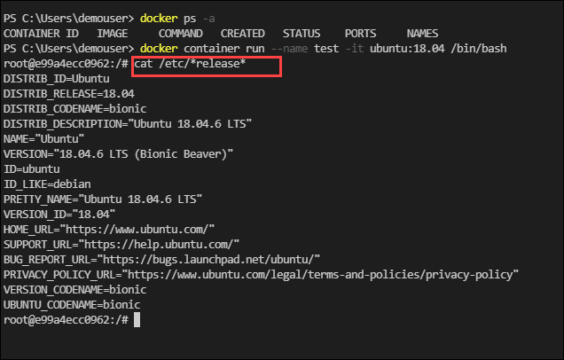
   
5. Exit the container by running the below command.

   ```
   exit
   ```
   
5. Enter the below command to show the list of running containers and observe your container is not listed this is because the container is in the stopped state.

   ```
   docker ps 
   ```

   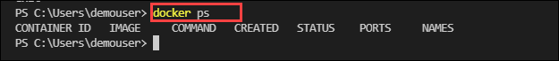
   
6. Start your container by running the below command:

   ```
   docker container start test
   ```
   
   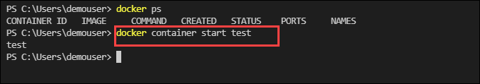
   
7. In the terminal run ```docker ps``` and verify your container status is up.

   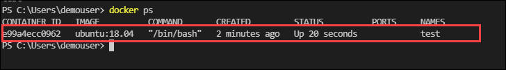
   
8. Rename your container from test to prod by running the below command:

   ```
   docker container rename test prod
   ```
   
9. Run the docker list command and observe your container is renamed to prod.

   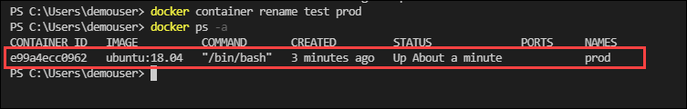

10. Now run the below command to get the process details of the container.

    ```
    docker top prod
    ```
    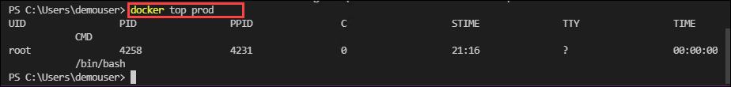
    
11. Run the below commands to create a bash session into the container and create files in the container.

    ```
    docker exec -it prod bash 
    ```
    
12. Now inside the container create a file named temp1 by running the below command:

     ```
     touch temp1
     ```
     
13. Verify that you are can to list your newly created file and exit from the container:

    ```
    ls -l
    ```
    
    ```
    exit
    ```   
    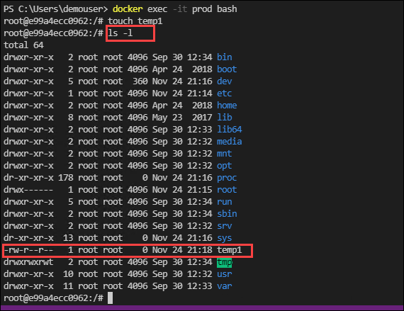
    
14. Now copy the  temp file which you create inside the container to  the host machine by running the below command

    ```
    docker cp prod:/temp1  c:\users\demouser
    ```
15. In your terminal run the list command and verify the file has been copied from your container to the host machine.

    ```
    ls
    ```
    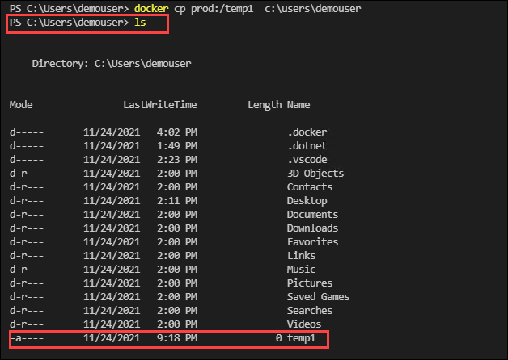


### Exercise 3: Working with Docker images

A Docker image is a file used to execute code in a Docker container. Docker images act as a set of instructions to build a Docker container, like a template. Docker images also act as the starting point when using Docker. An image is comparable to a snapshot in virtual machine (VM) environments.

A Docker image contains application code, libraries, tools, dependencies and other files needed to make an application run. When a user runs an image, it can become one or many instances of a container.

1. In your terminal run the below command to list all the images that are present in your system. Notice your ubuntu image is listed.

   ```
   docker image ls
   ```
   
2. Now pull an image from docker hub run the below command:

   ```
   docker pull mcr.microsoft.com/windows/servercore/iis
   ```
   
3. In your LabVm navigate to c:/files path and create a file named Dockerfile with the following contents.. You will build the image with the Dockerfile.

   ```
   # escape=`

   FROM mcr.microsoft.com/windows/servercore/iis

   # Install IIS, LogMonitor.exe and ServiceMonitor.exe
   RUN powershell -Command `
    Add-WindowsFeature Web-Server; `
    New-Item -ItemType Directory C:\LogMonitor; `
    $downloads = `
    @( `
        @{ `
            uri = 'https://dotnetbinaries.blob.core.windows.net/servicemonitor/2.0.1.10/ServiceMonitor.exe'; `
            outFile = 'C:\ServiceMonitor.exe' `
        }, `
        @{ `
            uri = 'https://github.com/microsoft/windows-container-tools/releases/download/v1.1/LogMonitor.exe'; `
            outFile = 'C:\LogMonitor\LogMonitor.exe' `
        }, `
        @{ `
            uri = 'https://raw.githubusercontent.com/microsoft/iis-docker/main/windowsservercore-insider/LogMonitorConfig.json'; `
            outFile = 'C:\LogMonitor\LogMonitorConfig.json' `
        } `
    ); `
    $downloads.ForEach({ Invoke-WebRequest -UseBasicParsing -Uri $psitem.uri -OutFile $psitem.outFile })

   # Change the startup type of the IIS service from Automatic to Manual
   RUN sc config w3svc start=demand

   # Enable ETW logging for Default Web Site on IIS
   RUN c:\windows\system32\inetsrv\appcmd.exe set config -section:system.applicationHost/sites /"[name='Default Web Site'].logFile.logTargetW3C:"File,ETW"" /commit:apphost

   EXPOSE 80

   # Start "C:\LogMonitor\LogMonitor.exe C:\ServiceMonitor.exe w3svc"
   ENTRYPOINT ["C:\\LogMonitor\\LogMonitor.exe", "C:\\ServiceMonitor.exe", "w3svc"]
   ```
   
   **Note**: Please check that the file Dockerfile has no file extension like .txt
   
4. In the terminal build the container image using the docker build command.

   ```
   docker build -t iis-site .
   ```
   
5. Run ```docker images``` command and verify your image is created

6. Now that you have an image ready, create and run a container from the image using the below command. 

   ```
   docker run -d -p 8000:80 --name my-running-site iis-site
   ```
  
7. Run the below comand to get IP address of the container.

   Copy the Ip address value

   ```
   docker inspect -f "{{ .NetworkSettings.Networks.nat.IPAddress }}" my-running-site
   ```
   
8. Open edge browser in your LabVm and browse to the below link:

   Make sure to replace ```your_ip_address``` with the Ip of your container that you copied in above step.

   ```
   http://your_ip_address:80
   ```

9. Verify that you are able to see IIS web page.


10. You have successfully built a image from dockerfile and created a cotainer from the image with the IIS website hosted on it. 

#### Push image to Docker hub

11. Now login to the Docker Hub using the below command. When promted enter your docker username and password.

    ```
    docker login
    ```

12. Use the docker tag command to give your image a new name. Be sure to replace YOUR-USER-NAME with your Docker ID.

    ```
    docker tag  iis-site YOUR-USER-NAME/iis-site
    ```
    
13.  Push your image to the repository you created

     ```
     docker push YOUR-USER-NAME/iis-site
     ```
    
### Exercise 4: Docker compose

Docker Compose is a tool that was developed to help define and share multi-container applications. With Compose, we can create a YAML file to define the services and with a single command, can spin everything up or tear it all down.

The big advantage of using Compose is you can define your application stack in a file, keep it at the root of your project repo (it’s now version controlled), and easily enable someone else to contribute to your project. 


1. In the terminal verify the installation of docker-compose by running the below command

   ```
   docker-compose version
   ```

2. Navigate to c:/dockercomposefiles folder and create a docker-compose.yml file.

3. Enter the below code in docker-compose.ynl file and save it.

   ```
   ```

4. Now
